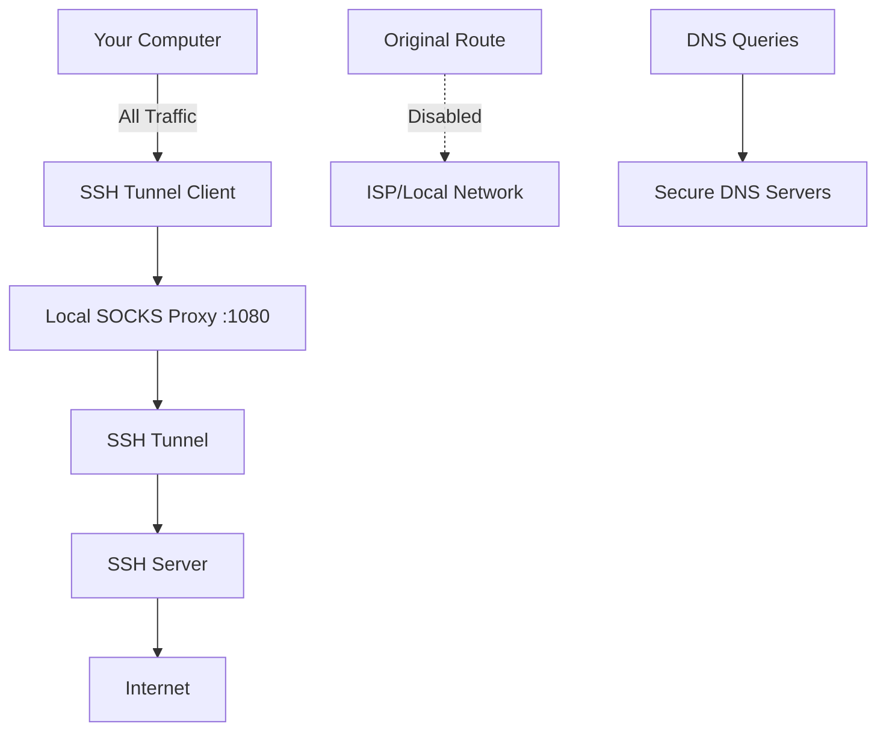

# 📖 Usage Guide

Complete guide on how to use SSH Tunnel Client for secure traffic routing.

## 🚀 Quick Start

### 1. Launch the Application

After installation, launch SSH Tunnel Client:

```bash
# Using the launcher script
./run.sh

# Or directly
sudo python3 ssh_tunnel_client.py
```

### 2. Enter SSH Server Details

Fill in your SSH server information:

- **Server IP/Hostname**: Your SSH server address (e.g., `203.0.113.1` or `myserver.com`)
- **Port**: SSH port (usually `22`)
- **Username**: Your SSH username
- **Password**: Your SSH password

### 3. Test Connection

Click **"Test Connection"** to verify SSH access before establishing tunnel.

### 4. Connect

Click **"Connect"** to start the SSH tunnel. All your internet traffic will now route through the SSH server.

### 5. Monitor Status

Watch the status indicator and activity logs to monitor your connection.

### 6. Disconnect

Click **"Disconnect"** to stop the tunnel and restore original network settings.

---

## 🔧 Detailed Configuration

### SSH Server Settings

<table>
<tr>
<th>Field</th>
<th>Description</th>
<th>Example</th>
</tr>
<tr>
<td><strong>Server IP</strong></td>
<td>SSH server IP address or hostname</td>
<td><code>203.0.113.1</code> or <code>myserver.com</code></td>
</tr>
<tr>
<td><strong>Port</strong></td>
<td>SSH service port</td>
<td><code>22</code> (default), <code>2222</code>, etc.</td>
</tr>
<tr>
<td><strong>Username</strong></td>
<td>SSH account username</td>
<td><code>ubuntu</code>, <code>root</code>, <code>myuser</code></td>
</tr>
<tr>
<td><strong>Password</strong></td>
<td>SSH account password</td>
<td>Your secure password</td>
</tr>
</table>

### Advanced Settings

Access advanced options through environment variables:

```bash
# Custom DNS servers (comma-separated)
export SSH_TUNNEL_DNS="1.1.1.1,8.8.8.8"

# Custom SOCKS proxy port
export SSH_TUNNEL_SOCKS_PORT=1081

# Connection timeout (seconds)
export SSH_TUNNEL_TIMEOUT=30

# Enable debug logging
export SSH_TUNNEL_DEBUG=1

# Launch with custom settings
sudo python3 ssh_tunnel_client.py
```

---

## 🌐 Network Configuration

### How It Works



### What Happens When You Connect

1. **SOCKS Proxy Setup**: Creates local SOCKS5 proxy on port 1080
2. **SSH Tunnel**: Establishes encrypted SSH connection to your server
3. **Route Modification**: Changes system routing to use the tunnel
4. **DNS Change**: Updates DNS servers to secure alternatives
5. **Traffic Routing**: All network traffic flows through SSH tunnel

### What Happens When You Disconnect

1. **Tunnel Closure**: Safely closes SSH connection
2. **Route Restoration**: Restores original network routing
3. **DNS Restoration**: Restores original DNS settings
4. **Proxy Cleanup**: Stops local SOCKS proxy
5. **Network Reset**: Returns to pre-connection state

---

## 🎛️ GUI Interface Guide

### Main Window Components

#### 🔧 Connection Panel
- **Server Configuration**: Enter SSH server details
- **Test Button**: Verify connection before tunneling
- **Connect/Disconnect**: Main action button
- **Status Indicator**: Shows current connection state

#### 📊 Status Panel
- **Connection Status**: Real-time connection state
- **Server Info**: Connected server details
- **Traffic Stats**: Data transfer statistics (if available)
- **Uptime**: Connection duration

#### 📝 Activity Log
- **Real-time Logs**: Live activity feed
- **Timestamp**: Each log entry timestamped
- **Log Levels**: Info, Warning, Error messages
- **Scroll View**: Scrollable log history

#### ⚙️ Settings Panel
- **Language Toggle**: Switch between English/Persian
- **Auto-Connect**: Automatic connection on startup
- **Save Config**: Save server settings (no passwords)
- **Advanced Options**: Additional configuration options

### Status Indicators

| Indicator | Status | Description |
|-----------|--------|-------------|
| 🔴 **Red** | Disconnected | No active tunnel |
| 🟡 **Yellow** | Connecting | Establishing connection |
| 🟢 **Green** | Connected | Tunnel active and working |
| 🔵 **Blue** | Testing | Testing SSH connection |
| ⚪ **Gray** | Error | Connection problem |

---

## 🔒 Security Best Practices

### SSH Server Security

#### Server Configuration
```bash
# /etc/ssh/sshd_config
Port 22                          # Or custom port like 2222
Protocol 2                       # SSH-2 only
PermitRootLogin no              # Disable root login
PasswordAuthentication yes       # Enable password auth
PubkeyAuthentication yes        # Enable key auth (recommended)
MaxAuthTries 3                  # Limit login attempts
ClientAliveInterval 300         # Keep connection alive
ClientAliveCountMax 2           # Max missed heartbeats
```

#### Firewall Configuration
```bash
# Allow SSH port
sudo ufw allow 22/tcp

# Or custom port
sudo ufw allow 2222/tcp

# Enable firewall
sudo ufw enable
```

### Client Security

#### Password Security
- Use strong, unique passwords
- Consider SSH key authentication
- Never share credentials
- Change passwords regularly

#### Connection Security
- Always verify server identity on first connection
- Monitor connection logs for suspicious activity
- Disconnect when not needed
- Use trusted networks for initial setup

#### System Security
- Keep SSH Tunnel Client updated
- Run antivirus scans regularly
- Use encrypted storage for sensitive data
- Enable system firewall

---

## 🛠️ Advanced Usage

### Command Line Options

```bash
# Show help
python3 ssh_tunnel_client.py --help

# Run in headless mode (no GUI)
python3 ssh_tunnel_client.py --headless --server 203.0.113.1 --user myuser

# Specify custom config file
python3 ssh_tunnel_client.py --config /path/to/config.json

# Enable debug mode
python3 ssh_tunnel_client.py --debug

# Custom SOCKS port
python3 ssh_tunnel_client.py --socks-port 1081
```

### Configuration File

Create `~/.ssh_tunnel_config.json`:

```json
{
  "servers": [
    {
      "name": "My VPS",
      "host": "203.0.113.1",
      "port": 22,
      "username": "ubuntu"
    },
    {
      "name": "Work Server",
      "host": "work.example.com",
      "port": 2222,
      "username": "employee"
    }
  ],
  "settings": {
    "socks_port": 1080,
    "dns_servers": ["1.1.1.1", "8.8.8.8"],
    "connection_timeout": 30,
    "auto_connect": false,
    "language": "en",
    "log_level": "INFO"
  }
}
```

### Integration with Other Tools

#### Browser Configuration
```bash
# Firefox with SOCKS proxy
firefox --proxy-server="socks5://127.0.0.1:1080"

# Chrome with SOCKS proxy
google-chrome --proxy-server="socks5://127.0.0.1:1080"
```

#### System-wide Proxy
```bash
# Set system proxy (GNOME)
gsettings set org.gnome.system.proxy mode 'manual'
gsettings set org.gnome.system.proxy.socks host '127.0.0.1'
gsettings set org.gnome.system.proxy.socks port 1080

# Reset system proxy
gsettings set org.gnome.system.proxy mode 'none'
```

---

## 📊 Monitoring & Diagnostics

### Connection Monitoring

```bash
# Check tunnel status
ps aux | grep ssh_tunnel_client

# Monitor network connections
netstat -tulpn | grep :1080

# Check routing table
ip route show

# Monitor DNS resolution
nslookup google.com
dig google.com
```

### Performance Testing

```bash
# Test connection speed
curl -w "@curl-format.txt" -o /dev/null -s http://speedtest.net/api/api.php

# Check latency
ping -c 4 google.com

# Test DNS speed
dig @1.1.1.1 google.com
```

### Log Analysis

```bash
# View application logs
tail -f ssh_tunnel.log

# Filter for errors
grep -i error ssh_tunnel.log

# Monitor real-time activity
watch -n 1 'tail -10 ssh_tunnel.log'
```

---

## 🚨 Troubleshooting Common Issues

### Connection Problems

<details>
<summary><strong>SSH Connection Fails</strong></summary>

**Symptoms**: Can't establish SSH connection

**Solutions**:
1. Verify server IP and port
2. Check username and password
3. Test manual SSH: `ssh user@server`
4. Check server SSH service: `sudo systemctl status ssh`
5. Verify firewall settings on server

</details>

<details>
<summary><strong>Tunnel Connects But No Internet</strong></summary>

**Symptoms**: SSH connects but no internet access

**Solutions**:
1. Check SOCKS proxy: `curl --socks5 127.0.0.1:1080 http://google.com`
2. Verify routing: `ip route show`
3. Test DNS: `nslookup google.com`
4. Restart NetworkManager: `sudo systemctl restart NetworkManager`

</details>

<details>
<summary><strong>Slow Connection Speed</strong></summary>

**Symptoms**: Internet is very slow through tunnel

**Solutions**:
1. Use geographically closer server
2. Check server bandwidth
3. Try different SSH encryption
4. Reduce SSH compression
5. Test without other applications

</details>

### Application Issues

<details>
<summary><strong>GUI Won't Start</strong></summary>

**Symptoms**: Application crashes on startup

**Solutions**:
1. Check Python version: `python3 --version`
2. Install tkinter: `sudo apt install python3-tkinter`
3. Run with debug: `python3 ssh_tunnel_client.py --debug`
4. Check display: `echo $DISPLAY`

</details>

<details>
<summary><strong>Permission Denied Errors</strong></summary>

**Symptoms**: Can't modify network settings

**Solutions**:
1. Run with sudo: `sudo python3 ssh_tunnel_client.py`
2. Check user permissions: `groups $USER`
3. Add user to netdev group: `sudo usermod -a -G netdev $USER`

</details>

---

## 📞 Getting Help

### Self-Help Resources

1. **Check logs**: Application logs contain detailed error information
2. **Test manually**: Try SSH connection manually first
3. **Check network**: Verify internet connectivity
4. **Read documentation**: Review this guide and README.md

### Community Support

1. **GitHub Issues**: [Report bugs and request features](https://github.com/reza-ygb/ssh-tunnel-client/issues)
2. **Discussions**: [Ask questions and share tips](https://github.com/reza-ygb/ssh-tunnel-client/discussions)
3. **Email Support**: support@ssh-tunnel-client.com

### When Reporting Issues

Include this information:
- Linux distribution and version
- Python version
- SSH Tunnel Client version
- Complete error message
- Steps to reproduce
- Application logs

---

## 🎓 Tips & Tricks

### Performance Optimization

- Use servers geographically close to you
- Choose servers with good bandwidth
- Close unnecessary applications
- Use wired connection when possible

### Security Tips

- Change SSH passwords regularly
- Use SSH key authentication when possible
- Monitor connection logs
- Don't save passwords in browsers

### Productivity Tips

- Save server configurations for quick access
- Use keyboard shortcuts in GUI
- Monitor connection status regularly
- Keep application updated

---

**Happy tunneling! 🚀**
